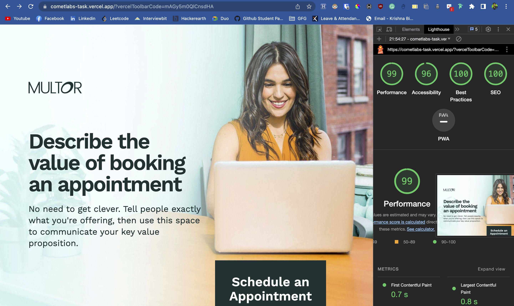
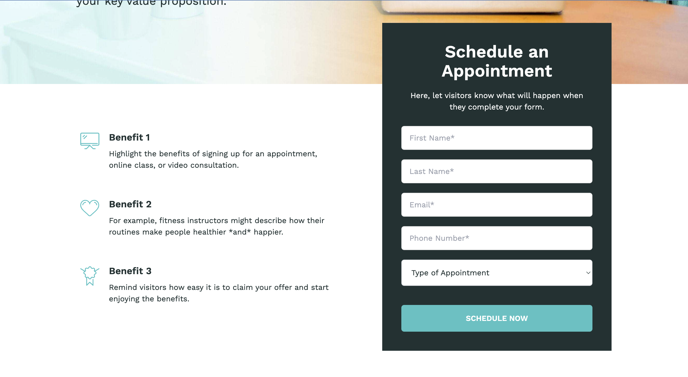
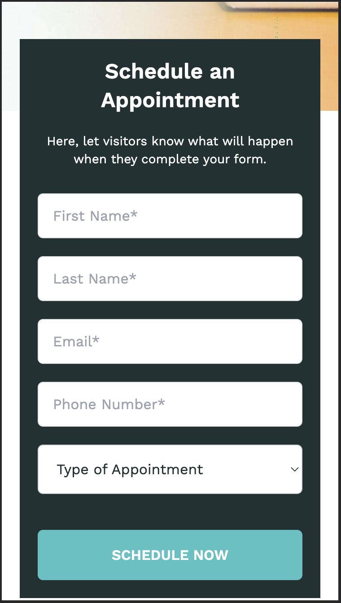

# Cometlabs Initial Task

This project is a clone of the [Multor Landing Page Template](https://unbounce.com/landing-page-template/multor/) from Unbounce.

## Local Setup

To set up the project locally, follow these steps:

1. Clone the repository:

```bash
git clone https://github.com/Phoenix6296/cometlabs-task.git
```

2. Change to the project directory:

```bash
cd cometlabs-task
```

3. Install the dependencies:

```bash
npm install
```

4. Start the development server:

```bash
npm run dev
```

## Project Structure

The project has the following structure:

```
cometlabs-task/
├── app/
│   ├── global.css
│   ├── layout.js
│   └── page.js
│   components/
│   ├── Benefits/
│   ├── common/
│   ├── Features/
│   └── Testimonials/
│   utils/
│   ├── constants/
│       ├── index.js
│
├── .gitignore
├── package.json
└── README.md
```

- The `app` directory contains the main JavaScript files (`page.js`) and the global CSS file (`global.css`) for the landing page.
- The `components` directory contains reusable components used in the landing page, such as Benefits, Features, Testimonials, and common components.
- The `utils` directory contains utility files, including constants.
- The `.gitignore` file specifies which files and directories should be ignored by Git.
- The `package.json` file lists the project's dependencies and scripts.
- The `README.md` file (this file) provides information about the project.

## Usage

After setting up the project locally and starting the development server, you can access the website by visiting `http://localhost:3000` in your web browser.

## Additional Notes

- This clone project is intended for learning purposes and to demonstrate the ability to replicate a static website design.
- The cloned website may not have full functionality, such as form submission or interactive components, as it is a static clone.
- Any additional features or modifications can be implemented by extending the project's codebase.
- For a complete and functional version of the original Multor Landing Page Template, please visit the [Unbounce website](https://unbounce.com/landing-page-template/multor/).

## Live Demo

A live demo of this cloned landing page can be accessed at [https://cometlabs-task.vercel.app/](https://cometlabs-task.vercel.app/).

## Performance

The performance of the website is optimized to provide a smooth and fast user experience. Here is a screenshot of the performance metrics obtained from Lighthouse:

### Performance Metrics



## Screenshots

### Large Device




### Mobile Device




## Conclusion

With these instructions, you should be able to set up the project locally and explore the cloned Multor Landing Page Template. Feel free to customize, enhance, or modify the project as per your requirements. Happy coding!
